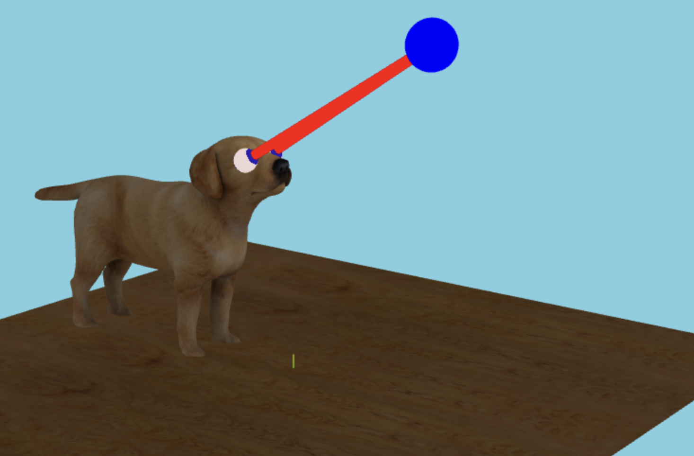

# Assignment 3

See A3.pdf for the assignment specifications.

Part 1:

a) glb loader implemented and function in A3.js altered slightly

        function loadAndPlaceGLB(file, place) {
        //TODO: implement this function to load the GLB model
        //we can copy/paste this from obj loader as it doesn't change
        const manager = new THREE.LoadingManager();
        manager.onProgress = function (item, loaded, total) {
            console.log(item, loaded, total);
        };

        const onProgress = function (xhr) {
            if (xhr.lengthComputable) {
                const percentComplete = xhr.loaded / xhr.total * 100.0;
                console.log(Math.round(percentComplete, 2) + '% downloaded');
            }
        };

        const loader = new GLTFLoader(manager);
        loader.load(
            file,
            function (gltf) {
                place(gltf.scene);
            },
            onProgress,
            function (error) {
                //decided to put simple error handling just as a force of habit, it's never a bad idea
                console.log("Something has gone wrong somewhere with your model");
            }
        )
    }

    // TODO: Load and place the dog geometry in GLB format, a simple example is provided
    //the only change needed here is to just tell this to add the dog with scene.add(dog)
    loadAndPlaceGLB("glb/dog.glb", function (dog) {
    dog.traverse(function (child) {
        if (child instanceof THREE.SkinnedMesh) {
        var skeleton = new THREE.Skeleton(child.skeleton.bones);
        for (var i = 0; i < skeleton.bones.length; i++) {
            console.log(skeleton.bones[i].name);
            if (skeleton.bones[i].name == "Dog_Tail_01_02SHJnt_42") {
            console.log("Tail bone found");
            }
        }
        }
    });
    dog.scale.set(5, 5, 5);
    dog.position.set(0.0, 0.0, -8.0);
    scene.add(dog);
    });

Result:

b) I decided to group both eyes together into a singular eye group because the eye's positions relative to each other shouldn't ever change and
this greatly simplifies the construction of matrices. Time will tell if there are unforeseen complications with this approach. I've also
decided to give the matrix fields variables as I have a feeling this may prove useful later on

    // TODO: Create two eye ball meshes from the same geometry

    //I'm going to try parenting both eyes to a singular "eye group", as their position relative to each other
    //on the dog should always stay the same I dont think there's a need to transfrom them both independently
    //where raw position is concerned
    const eyeGeometry = new THREE.SphereGeometry(1.0, 32, 32);
    const eyeScale = 0.5;
    const eyeGroup = new THREE.Object3D();

    const leftEyeSocket = new THREE.Object3D();
    const leftEyeSocketPos = new THREE.Vector3(-0.8, 9.2, 0.5);
    leftEyeSocket.position.copy(leftEyeSocketPos);

    const leftEye = new THREE.Mesh(eyeGeometry, eyeMaterial);
    leftEye.scale.copy(new THREE.Vector3(eyeScale, eyeScale, eyeScale));
    leftEyeSocket.add(leftEye);

    scene.add(leftEyeSocket);

    const rightEyeSocket = new THREE.Object3D();
    const rightEyeSocketPos = new THREE.Vector3(0.8, 9.2, 0.5);
    rightEyeSocket.position.copy(rightEyeSocketPos);

    const rightEye = new THREE.Mesh(eyeGeometry, eyeMaterial);
    rightEye.scale.copy(new THREE.Vector3(eyeScale, eyeScale, eyeScale));
    rightEyeSocket.add(rightEye);

    const [Tx,Ty,Tz] = [0, 0, -2];
    const Rxv = 0;
    const Ryv = 0;
    const Rzv = 0;
    const [Sx, Sy, Sz] = [1, 1, 1];

    //modelMatrix for the eye group
    const T = new THREE.Matrix4().makeTranslation(Tx, Ty, Tz);
    const Rx = new THREE.Matrix4().makeRotationX(Rxv);
    const Ry = new THREE.Matrix4().makeRotationY(Ryv);
    const Rz = new THREE.Matrix4().makeRotationZ(Rzv);
    const S = new THREE.Matrix4().makeScale(Sx, Sy, Sz);

    const modelMatrix = new THREE.Matrix4();
    modelMatrix.multiply(T).multiply(Rz).multiply(Ry).multiply(Rx).multiply(S);

    eyeGroup.add(rightEyeSocket, leftEyeSocket);
    eyeGroup.matrixAutoUpdate = false;
    eyeGroup.matrix.copy(modelMatrix);

    scene.add(eyeGroup);

Result:

c) This was as simple as gettihng the sphere's coordinates in the update function and telling the
eyes to "lookAt()" where the sphere currently is. On a somewhat humorous note, I spent the better
part of two hours trying to debug the eyes flipping 90 degrees whenever calling this function, as 
though that were some kind of bug and not the pupils just snapping to track the sphere which 
spawns directly below the dog. So that was fun

    function update() {
    // TODO: make neccesary changes to implement gazing, the dog waving its tail, etc.
    checkKeyboard();

    //we should be able to just track the spheres position vector and tell our eye group
    //to track it. In theory. In practice, well let's see

    const spherePos = new THREE.Vector3(sphereOffset.value.x, sphereOffset.value.y, sphereOffset.value.z);

    leftEyeSocket.lookAt(spherePos);
    rightEyeSocket.lookAt(spherePos);

    // Requests the next update call, this creates a loop
    requestAnimationFrame(update);
    renderer.render(scene, camera);
    }

Results:
   

d) For the proximity laser I basically use update() to calculate the per frame distance from the eyes to the sphere and if its within a certain threshold I trigger the lasers visible (invisible by default) and scale them to always make contact with the sphere. The lasers were already joined with the pupils in the creation of the meshes so nothing fancy was needed to keep them aligned other than a simple rotation of the base geometry

    // TODO: make necessary changes to implement the laser eyes
    const laserMaterial = new THREE.MeshBasicMaterial({color: 0xff0000});

    const laserGeometry = new THREE.CylinderGeometry(.2,.2,1,8,8,false);
    laserGeometry.translate(0,.5,0);
    laserGeometry.rotateX(Math.PI/2);

    const leftLaser = new THREE.Mesh(laserGeometry, laserMaterial);
    const rightLaser = new THREE.Mesh(laserGeometry, laserMaterial);
    leftEyeSocket.add(leftLaser);
    rightEyeSocket.add(rightLaser);
    leftLaser.visible = false;
    rightLaser.visible = false;

  //now we need to handle the laser. I'm going to choose to handle this by setting the laser to some arbitrary
  //default values and set them invisible on load. If the sphere comes close enough, the lasers will become visible
  //and will stretch to meet the sphere wherever it is.

  //we want to do distance calculations against the sphere and both eyes, but the eyes are part of a different scene graph and
  //are not currently in world coordinates whereas the sphere already is. We would need the world coords of the eyes, but because
  //they are childs of the eyegroup parent, and eyegroup is itself in world space already, we should be able to use that for 
  //this distance calculation and save some work that way
   const leftWorld = new THREE.Vector3;
  const rightWorld = new THREE.Vector3;
  leftEyeSocket.getWorldPosition(leftWorld);
  rightEyeSocket.getWorldPosition(rightWorld);

  const sphereToDog = leftWorld.distanceTo(spherePos);
  

  if (sphereToDog < LaserDistance) {
    leftLaser.visible = true;
    rightLaser.visible = true;
  
  //so that works but turns out we need the world space coordinates of the eyes anyway to calculate the laser distance
 

  const laserGrow = (laser, eye) => {
    const directionVector = new THREE.Vector3().subVectors(spherePos, eye);
    const lengthToSphere = directionVector.length();
    laser.scale.set(1, 1, lengthToSphere);
    }
    laserGrow(leftLaser, leftWorld);
    laserGrow(rightLaser, rightWorld);
  }
    else {
    leftLaser.visible = false;
    rightLaser.visible = false;
    }

Results:
  

e) For this section I made the perhaps incorrect choice to just use my previously defined "sphereToDog" distance check 
here as well just because I'd already calculated it and there's really not much - if any - functional difference to be gained
from going from the center of the dog I don't think. I also couldn't figure out if the instructions were explicitly asking for the tail wagging to increase along a smooth gradient or if it just wanted the wag to be kicked up another notch after
a certain distance, so I just did the latter. The basic structure of this section consisted of grabbing the tailbone from the glb file and storing it into a var, and then (making sure to run a check first to account for asynchronous callbacks),
having the tail wag along the y-axis at some moderate time and then increasing when the sphere infiltrates the pup's personal space. At that point the eyes also snap to the camera as if to tell the user to cut it out with the encroachment already. I also decided to shut the lasers off at that point just because I thought it looked better. 

    var tail = null;

    loadAndPlaceGLB("glb/dog.glb", function(dog) {
    dog.traverse(function(child) {
        if (child instanceof THREE.SkinnedMesh) {
            var skeleton = new THREE.Skeleton(child.skeleton.bones);
            for (var i = 0; i < skeleton.bones.length; i++) {
                console.log(skeleton.bones[i].name);
                if (skeleton.bones[i].name == "Dog_Tail_01_02SHJnt_42") {
                    tail = skeleton.bones[i];
                    console.log("Tail bone found");
                }
            }
        }
    });
    dog.scale.set(5, 5, 5);
    dog.position.set(0.0, 0.0, -8.0);
    scene.add(dog);
});

    //tail wag and eye shift 
    if (tail) {
      const time = clock.getElapsedTime();
      tail.rotation.y = Math.sin(time * 6) * 1;

      if (sphereToDog < waveDistance) {
        tail.rotation.y = Math.sin(time * 25) * 1.2;
        leftEyeSocket.lookAt(camera.position);
        rightEyeSocket.lookAt(camera.position);
        leftLaser.visible = false;
        rightLaser.visible = false;
      }
    }

Results:
 